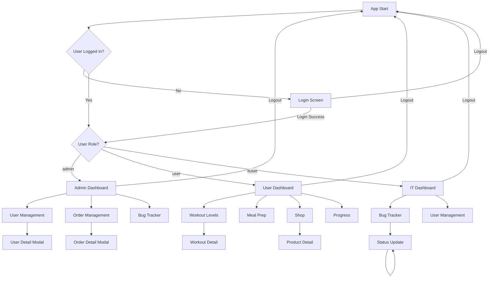

# Gym OS Mobile App - Android Expo Specification

## Document Overview

This specification document provides a comprehensive technical blueprint for building the Android Expo version of the Gym OS mobile application, based on the existing iOS React Native implementation.

**Version**: 1.0  
**Date**: 2025-01-07  
**Platform**: Android (Expo)  
**Reference Implementation**: iOS React Native (gym-os-mobile-ios)

---

## Table of Contents

1. [Project Overview](#project-overview)
2. [Architecture](#architecture)
3. [Screen Specifications](#screen-specifications)
4. [Navigation Flow](#navigation-flow)
5. [UI Component Hierarchy](#ui-component-hierarchy)
6. [State Management](#state-management)
7. [Data Structure](#data-structure)
8. [Dependencies](#dependencies)
9. [Styling Guidelines](#styling-guidelines)
10. [Platform Considerations](#platform-considerations)
11. [API Integration Notes](#api-integration-notes)

---

## Project Overview

### Application Purpose

Gym OS is a comprehensive fitness management application designed for multiple user roles:
- **Regular Users**: Track workouts, meal plans, progress, and shop for fitness products
- **Admins**: Manage users, view orders, and monitor system health
- **IT Users**: Track and resolve bugs, manage users

### Key Features

1. **Authentication System**
   - Role-based access control (admin, user, ituser)
   - Persistent login using AsyncStorage
   - Demo accounts for testing

2. **User Dashboard**
   - Personalized workout programs (5 difficulty levels)
   - Meal planning based on fitness goals (fat loss, muscle building, recomposition)
   - Progress tracking with charts and statistics
   - E-commerce shop for fitness products

3. **Admin Dashboard**
   - User management with search and filtering
   - Order management and tracking
   - System statistics and activity monitoring

4. **IT Dashboard**
   - Bug tracking system
   - Bug status management (open, in-progress, resolved)
   - User management integration

---

## Architecture

### Project Structure

```
gym-os-mobile-android/
├── App.js                          # Root component
├── app.json                        # Expo configuration
├── package.json                    # Dependencies
├── babel.config.js                 # Babel configuration
├── assets/                        # Static assets
│   ├── adaptive-icon.png
│   ├── favicon.png
│   ├── icon.png
│   └── splash.png
├── src/
│   ├── context/                    # React Context providers
│   │   └── AuthContext.js         # Authentication state management
│   ├── database/                   # Static data (to be replaced with API)
│   │   └── data.js                # Users, workouts, meals, products, bugs, orders
│   ├── navigation/                 # Navigation configuration
│   │   └── AppNavigator.js        # Stack and Tab navigators
│   └── screens/                   # Screen components
│       ├── LoginScreen.js
│       ├── admin/
│       │   ├── AdminDashboard.js
│       │   ├── UserManagementScreen.js
│       │   └── OrderManagementScreen.js
│       ├── user/
│       │   ├── UserDashboard.js
│       │   ├── WorkoutLevelsScreen.js
│       │   ├── WorkoutDetailScreen.js
│       │   ├── MealPrepScreen.js
│       │   ├── ShopScreen.js
│       │   ├── ProductDetailScreen.js
│       │   └── ProgressScreen.js
│       └── it/
│           ├── ITDashboard.js
│           ├── BugTrackerScreen.js
│           └── BugDetailScreen.js
```

### Technology Stack

- **Framework**: React Native 0.73.6
- **Runtime**: Expo SDK 50.0.0
- **Language**: JavaScript (ES6+)
- **Navigation**: React Navigation v6
- **State Management**: React Context API
- **Storage**: AsyncStorage
- **Icons**: Ionicons (@expo/vector-icons)

---

## Screen Specifications

### 1. Login Screen

**File**: `src/screens/LoginScreen.js`

**Purpose**: 
- User authentication entry point
- Validates credentials against user database
- Stores authenticated user session

**Components**:
- Logo/branding section
- Username input field with icon
- Password input field with show/hide toggle
- Login button with loading state
- Demo accounts reference section

**Key Features**:
- Keyboard avoiding view for better UX
- Password visibility toggle
- Form validation (required fields)
- Loading state during authentication
- Demo credentials display for testing

**Demo Accounts**:
- Admin: `admin / admin123`
- User: `john / user123`
- User: `jane / user123`
- User: `mike / user123`
- IT User: `ituser / it123`

---

### 2. User Dashboard

**File**: `src/screens/user/UserDashboard.js`

**Purpose**:
- Main home screen for regular users
- Displays personalized fitness statistics
- Quick access to all user features

**Components**:
- Welcome header with logout button
- Streak banner (motivational element)
- Statistics cards (4 stats in grid layout)
- Quick action buttons (4 actions)
- Current workout program card
- Today's nutrition card

**Statistics Displayed**:
- Current streak (days)
- Workout level
- Daily calorie target
- Fitness goal

**Quick Actions**:
- Start Workout
- View Meals
- Track Progress
- Shop Now

**Key Features**:
- Dynamic content based on user's current level and goal
- Visual streak tracking
- Navigation to all major features
- Personalized workout and meal plan preview

---

### 3. Workout Levels Screen

**File**: `src/screens/user/WorkoutLevelsScreen.js`

**Purpose**:
- Display all available workout programs
- Allow users to browse and select workout levels
- Show current level indicator

**Components**:
- Header with title and subtitle
- Scrollable list of workout level cards

**Workout Levels** (5 total):
1. **Beginner** (Difficulty: 1/5)
   - Duration: 4-6 weeks
   - 2 workouts: Full Body Basics, Core Foundation

2. **Moderate** (Difficulty: 2/5)
   - Duration: 6-8 weeks
   - 2 workouts: Upper Body Strength, Lower Body Power

3. **Pro-Level** (Difficulty: 3/5)
   - Duration: 8-10 weeks
   - 2 workouts: Push Pull Legs A, Push Pull Legs B

4. **Elite** (Difficulty: 4/5)
   - Duration: 10-12 weeks
   - 2 workouts: Hypertrophy Focus, Strength Focus

5. **God-Level** (Difficulty: 5/5)
   - Duration: 12+ weeks
   - 1 workout: Ultimate Full Body

**Card Information**:
- Level name with current badge
- Difficulty stars (1-5)
- Description
- Duration
- Number of workouts

**Key Features**:
- Visual difficulty indicators (colored stars)
- Current level highlighting
- Tap to view workout details

---

### 4. Workout Detail Screen

**File**: `src/screens/user/WorkoutDetailScreen.js`

**Purpose**:
- Display detailed information about a specific workout level
- Show all exercises within each workout
- Provide workout metadata

**Components**:
- Back navigation header
- Level information card
- Workout cards (one per workout in level)

**Workout Information**:
- Level name and description
- Duration
- Number of workouts

**Workout Card Components**:
- Workout name
- Duration and calories
- Play button (placeholder)
- Exercise list with details:
  - Exercise number
  - Exercise name
  - Sets, reps, and rest time

**Exercise Details**:
- Exercise name
- Number of sets
- Reps per set
- Rest period between sets

**Key Features**:
- Clear exercise progression
- Visual hierarchy for workout information
- Start workout button (placeholder for future implementation)

---

### 5. Meal Prep Screen

**File**: `src/screens/user/MealPrepScreen.js`

**Purpose**:
- Display personalized meal plans based on fitness goals
- Allow goal selection to customize meal plans
- Show detailed nutritional information for each meal

**Components**:
- Header with title and subtitle
- Goal selector (3 goals)
- Daily calorie banner
- Meal sections (4 types)
- Meal detail modal

**Fitness Goals**:
1. **Fat Loss** - 1,800 calories/day
2. **Muscle Building** - 3,000 calories/day
3. **Body Recomposition** - 2,400 calories/day

**Meal Types**:
- Breakfast (2 options per goal)
- Lunch (2 options per goal)
- Snacks (2 options per goal)
- Dinner (2 options per goal)

**Meal Card Information**:
- Meal name
- Calories
- Macros (protein, carbs, fats in grams)

**Meal Detail Modal**:
- Full meal name and calories
- Macro breakdown (large display)
- Ingredients list with checkmarks

**Key Features**:
- Dynamic meal plan based on selected goal
- Goal switching with visual feedback
- Detailed nutritional information
- Ingredient lists for meal preparation

---

### 6. Shop Screen

**File**: `src/screens/user/ShopScreen.js`

**Purpose**:
- E-commerce interface for fitness products
- Category-based product browsing
- Product grid display

**Components**:
- Header with title and subtitle
- Horizontal category selector
- Product grid (2 columns)

**Product Categories**:
1. **Apparels** (5 products)
   - Performance T-Shirt, Compression Shorts, Training Hoodie, Sports Bra, Training Pants

2. **Food & Supplements** (5 products)
   - Whey Protein Isolate, BCAA Powder, Pre-Workout, Creatine Monohydrate, Protein Bars

3. **Equipment** (5 products)
   - Adjustable Dumbbells, Resistance Bands Set, Yoga Mat Premium, Pull-up Bar, Kettlebell Set

4. **Tools** (5 products)
   - Smart Scale, Foam Roller, Jump Rope, Gym Bag, Water Bottle

**Product Card Information**:
- Product emoji/icon
- Product name (truncated to 2 lines)
- Description (truncated to 2 lines)
- Price
- Add to cart button

**Key Features**:
- Horizontal scrolling category selector
- Visual category selection feedback
- Responsive 2-column grid
- Quick add to cart functionality

---

### 7. Product Detail Screen

**File**: `src/screens/user/ProductDetailScreen.js`

**Purpose**:
- Display comprehensive product information
- Allow product customization (size, color, flavor)
- Handle add to cart and buy now actions

**Components**:
- Back navigation header with cart icon
- Product image display (emoji)
- Product information section
- Option selectors (size, color, flavor)
- Product information section
- Quantity selector
- Add to cart button with total
- Buy now button

**Product Information**:
- Product name
- Price
- Stock status
- Description

**Customization Options**:
- **Sizes**: S, M, L, XL, XXL (for apparels)
- **Colors**: Various options per product
- **Flavors**: Chocolate, Vanilla, Strawberry, etc. (for supplements)

**Product Metadata**:
- Weight (for supplements)
- Quantity (for bars)
- Stock count

**Key Features**:
- Dynamic option rendering based on product type
- Quantity selector with +/- buttons
- Real-time total calculation
- Add to cart confirmation alert
- Buy now placeholder button

---

### 8. Progress Screen

**File**: `src/screens/user/ProgressScreen.js`

**Purpose**:
- Track and display user fitness progress
- Show weight history, body measurements, and workout history
- Provide visual progress indicators

**Components**:
- Header with title and subtitle
- Tab selector (4 tabs)
- Tab content areas

**Tabs**:
1. **Overview**
   - Streak card with trend
   - Weight progress summary
   - Body measurements grid (4 measurements)
   - Recent activity

2. **Weight**
   - Complete weight history list
   - Date and weight for each entry
   - Weight change indicators

3. **Measurements**
   - Complete measurement history
   - Chest, waist, arms, thighs
   - Date for each entry

4. **Workouts**
   - Recent workout history
   - Completion status (completed/skipped)
   - Workout name and date

**Progress Metrics**:
- Weight (kg)
- Chest (cm)
- Waist (cm)
- Arms (cm)
- Thighs (cm)
- Workout completion streak

**Key Features**:
- Tab-based navigation within screen
- Visual progress indicators (positive/negative changes)
- Color-coded status badges
- Empty state handling

---

### 9. Admin Dashboard

**File**: `src/screens/admin/AdminDashboard.js`

**Purpose**:
- Main administrative interface
- Display system-wide statistics
- Provide quick access to admin functions

**Components**:
- Welcome header with logout button
- Statistics cards (4 stats)
- Quick action buttons (3 actions)
- Recent activity feed

**Statistics Displayed**:
- Total Users
- Active Orders
- Open Bugs
- In Progress Bugs

**Quick Actions**:
- Manage Users
- View Orders
- Bug Tracker

**Recent Activity**:
- Activity type indicators (order, bug, user)
- Activity message
- Time elapsed

**Key Features**:
- System-wide overview
- Quick navigation to admin functions
- Activity monitoring
- Real-time statistics (based on static data)

---

### 10. User Management Screen

**File**: `src/screens/admin/UserManagementScreen.js`

**Purpose**:
- Display all system users
- Allow user search and filtering
- View detailed user information

**Components**:
- Search bar
- User list (FlatList)
- User detail modal

**User Card Information**:
- Avatar (first letter with role color)
- User name and email
- Role badge (ADMIN, USER, IT USER)
- Current workout level
- Streak (if applicable)
- Join date

**User Detail Modal**:
- Large avatar
- User name and email
- Account information (username, role, join date)
- Fitness information (goal, level, streak) for regular users
- Edit user button

**Key Features**:
- Real-time search filtering
- Role-based color coding
- Detailed user information
- Edit user placeholder

---

### 11. Order Management Screen

**File**: `src/screens/admin/OrderManagementScreen.js`

**Purpose**:
- Display all system orders
- Allow order status tracking
- View detailed order information

**Components**:
- Order list (FlatList)
- Order detail modal

**Order Card Information**:
- Order ID
- Customer name
- Status badge (DELIVERED, SHIPPED, PROCESSING, PENDING)
- Number of items
- Order date
- Total amount

**Order Detail Modal**:
- Order summary (ID, status, dates)
- Customer information
- Order items list with quantities and prices
- Total amount
- Update status button

**Order Status Colors**:
- Delivered: Green (#34C759)
- Shipped: Blue (#007AFF)
- Processing: Orange (#FF9500)
- Pending: Red (#FF3B30)

**Key Features**:
- Status-based color coding
- Detailed order breakdown
- Customer information integration
- Status update placeholder

---

### 12. IT Dashboard

**File**: `src/screens/it/ITDashboard.js`

**Purpose**:
- Main IT support interface
- Display bug tracking statistics
- Provide quick access to IT functions

**Components**:
- Welcome header with logout button
- Statistics cards (4 stats)
- Quick action buttons (3 actions)
- Recent bugs list

**Statistics Displayed**:
- Open Bugs
- In Progress Bugs
- Resolved Bugs
- Total Users

**Quick Actions**:
- View All Bugs
- Manage Users
- Report Bug

**Recent Bugs**:
- Bug title
- Reporter name
- Severity badge (HIGH, MEDIUM, LOW)
- Status badge
- Reported date

**Key Features**:
- Bug tracking overview
- Quick navigation to bug tracker
- Recent bug monitoring
- Severity and status indicators

---

### 13. Bug Tracker Screen

**File**: `src/screens/it/BugTrackerScreen.js`

**Purpose**:
- Display all system bugs
- Allow bug filtering by status
- Enable bug search

**Components**:
- Search bar
- Horizontal status filter selector
- Bug list (FlatList)

**Status Filters**:
- All
- Open
- In Progress
- Resolved

**Bug Card Information**:
- Bug title
- Reporter name
- Severity badge (HIGH, MEDIUM, LOW)
- Bug description (truncated to 2 lines)
- Status badge
- Reported date

**Severity Colors**:
- High: Red (#FF3B30)
- Medium: Orange (#FF9500)
- Low: Green (#34C759)

**Status Colors**:
- Open: Red (#FF3B30)
- In Progress: Orange (#FF9500)
- Resolved: Green (#34C759)

**Key Features**:
- Real-time search filtering
- Status-based filtering
- Combined search and filter logic
- Empty state handling
- Tap to view bug details

---

### 14. Bug Detail Screen

**File**: `src/screens/it/BugDetailScreen.js`

**Purpose**:
- Display comprehensive bug information
- Allow bug status updates
- Enable comment addition

**Components**:
- Back navigation header with menu icon
- Bug header with badges
- Bug description section
- Bug information section
- People section (reporter and assignee)
- Status update section
- Comment section

**Bug Information**:
- Bug ID
- Title
- Description
- Severity
- Status
- Reported date
- Resolved date (if applicable)

**People Information**:
- Reporter (avatar, name, role)
- Assignee (avatar, name, role)

**Status Update**:
- Three status buttons: Open, In Progress, Resolved
- Visual feedback for selected status
- Status change confirmation alert

**Comment Section**:
- Multi-line text input
- Submit comment button
- Comment submission confirmation

**Key Features**:
- Comprehensive bug details
- Status management
- Comment functionality
- Visual status indicators
- User information integration

---

## Navigation Flow

### Navigation Architecture

The app uses a combination of Stack and Tab navigation from React Navigation v6:

```
AppNavigator (Stack)
├── Login Screen
└── Authenticated Routes (Role-based)
    ├── Admin Routes
    │   ├── AdminTabs (Bottom Tab)
    │   │   ├── Dashboard (AdminDashboard)
    │   │   ├── Users (UserManagementScreen)
    │   │   └── Orders (OrderManagementScreen)
    │   └── UserManagement (Stack Screen)
    │
    ├── User Routes
    │   ├── UserTabs (Bottom Tab)
    │   │   ├── Home (UserDashboard)
    │   │   ├── Workouts (WorkoutLevelsScreen)
    │   │   ├── Meals (MealPrepScreen)
    │   │   ├── Shop (ShopScreen)
    │   │   └── Progress (ProgressScreen)
    │   ├── WorkoutDetail (Stack Screen)
    │   └── ProductDetail (Stack Screen)
    │
    └── IT Routes
        ├── ITTabs (Bottom Tab)
        │   ├── Dashboard (ITDashboard)
        │   ├── Bugs (BugTrackerScreen)
        │   └── Users (UserManagementScreen)
        ├── BugDetail (Stack Screen)
        └── UserManagement (Stack Screen)
```

### Navigation Flow Diagram



### Navigation Patterns

1. **Authentication Flow**
   - Unauthenticated users → Login Screen
   - Successful login → Role-based dashboard
   - Failed login → Error alert

2. **Tab Navigation**
   - Each role has a bottom tab navigator
   - Tabs provide quick access to main features
   - Active tab is visually highlighted

3. **Stack Navigation**
   - Used for detail screens within each role
   - Back button navigation
   - Header with title

4. **Modal Navigation**
   - Used for detailed views (user details, order details, bug details, meal details)
   - Slide-up animation
   - Close button or tap outside to dismiss

---

## UI Component Hierarchy

### Common UI Components

#### 1. Card Components

**StatCard**
- Used in dashboards to display statistics
- Properties: title, value, icon, color
- Layout: Icon on left, text on right
- Styling: White background, shadow, colored left border

**WorkoutCard**
- Used in workout levels screen
- Properties: level object
- Layout: Header with difficulty stars, description, metadata
- Styling: White background, shadow, rounded corners

**MealCard**
- Used in meal prep screen
- Properties: meal object, type object
- Layout: Icon, name, calories, macros
- Styling: White background, shadow, rounded corners

**ProductCard**
- Used in shop screen
- Properties: product object
- Layout: Image, name, description, price, add button
- Styling: White background, shadow, rounded corners

**BugCard**
- Used in bug tracker screen
- Properties: bug object
- Layout: Header with badges, description, footer with status
- Styling: White background, shadow, rounded corners

#### 2. Badge Components

**RoleBadge**
- Displays user role (ADMIN, USER, IT USER)
- Color-coded based on role
- Rounded pill shape

**StatusBadge**
- Displays status (DELIVERED, SHIPPED, etc.)
- Color-coded based on status
- Rounded pill shape

**SeverityBadge**
- Displays bug severity (HIGH, MEDIUM, LOW)
- Color-coded based on severity
- Rounded pill shape

**CurrentBadge**
- Indicates current level/selection
- Blue background, white text

#### 3. Button Components

**ActionButton**
- Used for quick actions in dashboards
- Properties: title, icon, color, onPress
- Layout: Icon centered, text below
- Styling: White background, colored icon

**PrimaryButton**
- Used for main actions (login, add to cart, etc.)
- Properties: title, onPress, loading state
- Styling: Blue background, white text, rounded corners

**SecondaryButton**
- Used for alternative actions
- Properties: title, onPress
- Styling: Transparent background, blue border, blue text

**IconButton**
- Used for icon-only actions
- Properties: icon, onPress
- Styling: Circular or rounded square

#### 4. Input Components

**SearchInput**
- Used for search functionality
- Properties: placeholder, value, onChangeText
- Layout: Search icon, text input
- Styling: White background, shadow, rounded corners

**TextInput**
- Used for form inputs
- Properties: placeholder, value, onChangeText, secureTextEntry
- Layout: Icon (optional), text input, eye icon (for passwords)
- Styling: White background, border, rounded corners

#### 5. Modal Components

**DetailModal**
- Used for displaying detailed information
- Properties: visible, onRequestClose, children
- Layout: Header with close button, body content
- Styling: Semi-transparent overlay, white content, rounded top corners

#### 6. List Components

**FlatList**
- Used for displaying scrollable lists
- Properties: data, renderItem, keyExtractor
- Styling: Padding, spacing between items

**ScrollView**
- Used for scrollable content
- Properties: showsVerticalScrollIndicator
- Styling: Padding, content padding

### Component Reusability

The following components should be extracted into reusable components:

1. **StatCard** - Used in all dashboards
2. **ActionButton** - Used in all dashboards
3. **Badge** - Generic badge component for role, status, severity
4. **Card** - Generic card component with shadow
5. **Modal** - Generic modal component
6. **SearchInput** - Generic search input component
7. **EmptyState** - Generic empty state component

---

## State Management

### Authentication Context

**File**: `src/context/AuthContext.js`

**Purpose**: 
- Manage user authentication state
- Handle login/logout operations
- Persist user session

**State**:
```javascript
{
  user: Object | null,      // Current authenticated user
  loading: boolean           // Loading state for auth operations
}
```

**Methods**:
- `login(username, password)` - Authenticate user
- `logout()` - Clear user session
- `updateUser(updatedUser)` - Update user information

**Storage**:
- Uses AsyncStorage to persist user session
- Key: `'currentUser'`
- Stores: User object as JSON string

**User Object Structure**:
```javascript
{
  id: number,
  username: string,
  password: string,
  email: string,
  role: 'admin' | 'user' | 'ituser',
  name: string,
  goal?: 'fatloss' | 'bulk' | 'recomposition',
  currentLevel?: string,
  streak?: number,
  createdAt: string
}
```

### Local State Management

Each screen uses React's `useState` hook for local state:

**LoginScreen**:
- `username` - Input value
- `password` - Input value
- `showPassword` - Password visibility toggle
- `loading` - Login loading state

**WorkoutLevelsScreen**:
- No local state (read-only)

**MealPrepScreen**:
- `selectedMeal` - Currently selected meal for modal
- `modalVisible` - Modal visibility state
- `selectedGoal` - Currently selected fitness goal

**ShopScreen**:
- `selectedCategory` - Currently selected product category

**ProductDetailScreen**:
- `selectedSize` - Selected product size
- `selectedColor` - Selected product color
- `quantity` - Product quantity

**ProgressScreen**:
- `selectedTab` - Currently selected tab (overview, weight, measurements, workouts)

**UserManagementScreen**:
- `searchQuery` - Search input value
- `selectedUser` - Currently selected user for modal
- `modalVisible` - Modal visibility state

**OrderManagementScreen**:
- `selectedOrder` - Currently selected order for modal
- `modalVisible` - Modal visibility state

**BugTrackerScreen**:
- `searchQuery` - Search input value
- `filterStatus` - Selected status filter
- `modalVisible` - Modal visibility state

**BugDetailScreen**:
- `status` - Current bug status
- `comment` - Comment input value

---

## Data Structure

### Static Data Structure

**File**: `src/database/data.js`

This file contains all static data for the application. In production, this should be replaced with API calls.

#### Users Array

```javascript
[
  {
    id: 1,
    username: 'admin',
    password: 'admin123',
    email: 'admin@gymos.com',
    role: 'admin',
    name: 'Admin User',
    createdAt: '2024-01-01'
  },
  {
    id: 2,
    username: 'john',
    password: 'user123',
    email: 'john@gymos.com',
    role: 'user',
    name: 'John Doe',
    goal: 'fatloss',
    currentLevel: 'beginner',
    streak: 7,
    createdAt: '2024-01-15'
  },
  // ... more users
]
```

#### Workout Levels Array

```javascript
[
  {
    id: 1,
    name: 'Beginner',
    description: 'Perfect for those just starting their fitness journey',
    duration: '4-6 weeks',
    difficulty: 1, // 1-5 scale
    workouts: [
      {
        id: 1,
        name: 'Full Body Basics',
        exercises: [
          {
            name: 'Push-ups',
            sets: 3,
            reps: 10,
            rest: '60s'
          },
          // ... more exercises
        ],
        calories: 200,
        duration: '30 min'
      },
      // ... more workouts
    ]
  },
  // ... more levels
]
```

#### Meal Plans Object

```javascript
{
  fatloss: {
    name: 'Fat Loss',
    dailyCalories: 1800,
    meals: {
      breakfast: [
        {
          id: 1,
          name: 'Protein Oatmeal',
          ingredients: ['1/2 cup oats', '1 scoop protein powder', '1 banana', 'almonds'],
          calories: 350,
          protein: 30,
          carbs: 45,
          fats: 8
        },
        // ... more meals
      ],
      lunch: [...],
      snacks: [...],
      dinner: [...]
    }
  },
  bulk: { /* similar structure */ },
  recomposition: { /* similar structure */ }
}
```

#### Products Object

```javascript
{
  apparels: [
    {
      id: 1,
      name: 'Performance T-Shirt',
      price: 29.99,
      description: 'Moisture-wicking fabric, perfect for intense workouts',
      image: '👕',
      sizes: ['S', 'M', 'L', 'XL'],
      colors: ['Black', 'White', 'Navy', 'Red'],
      stock: 50
    },
    // ... more products
  ],
  food: [...],
  equipment: [...],
  tools: [...]
}
```

#### Progress Data Object

```javascript
{
  2: { // userId
    userId: 2,
    weightHistory: [
      { date: '2024-01-15', weight: 85 },
      { date: '2024-01-22', weight: 84.5 },
      // ... more entries
    ],
    bodyMeasurements: [
      { date: '2024-01-15', chest: 102, waist: 92, arms: 35, thighs: 55 },
      // ... more entries
    ],
    workoutHistory: [
      { date: '2024-01-15', workout: 'Full Body Basics', completed: true },
      // ... more entries
    ]
  },
  // ... more users
}
```

#### Bugs Array

```javascript
[
  {
    id: 1,
    title: 'App crashes on workout completion',
    description: 'When user completes a workout, the app crashes instead of saving progress',
    severity: 'high', // 'high' | 'medium' | 'low'
    status: 'open', // 'open' | 'in-progress' | 'resolved'
    reportedBy: 2, // userId
    reportedDate: '2024-02-20',
    assignedTo: 5, // userId
    resolvedDate: null // or date if resolved
  },
  // ... more bugs
]
```

#### Orders Array

```javascript
[
  {
    id: 1,
    userId: 2,
    items: [
      { productId: 1, name: 'Performance T-Shirt', quantity: 2, price: 29.99 },
      { productId: 6, name: 'Whey Protein Isolate', quantity: 1, price: 54.99 }
    ],
    total: 114.97,
    status: 'delivered', // 'delivered' | 'shipped' | 'processing' | 'pending'
    orderDate: '2024-02-01',
    deliveryDate: '2024-02-05'
  },
  // ... more orders
]
```

---

## Dependencies

### Required Dependencies

```json
{
  "dependencies": {
    "@react-native-async-storage/async-storage": "1.21.0",
    "@react-navigation/bottom-tabs": "^6.6.1",
    "@react-navigation/native": "^6.1.9",
    "@react-navigation/stack": "^6.3.20",
    "expo": "~50.0.0",
    "expo-status-bar": "~1.11.1",
    "react": "18.2.0",
    "react-native": "0.73.6",
    "react-native-chart-kit": "^6.12.0",
    "react-native-gesture-handler": "~2.14.0",
    "react-native-safe-area-context": "4.8.2",
    "react-native-screens": "~3.29.0",
    "react-native-svg": "14.1.0",
    "react-native-vector-icons": "^10.0.3"
  },
  "devDependencies": {
    "@babel/core": "^7.20.0"
  }
}
```

### Dependency Descriptions

#### Core Dependencies

1. **@react-native-async-storage/async-storage** (1.21.0)
   - Purpose: Persistent local storage
   - Usage: Store user authentication session
   - Platform: iOS, Android, Web

2. **@react-navigation/bottom-tabs** (^6.6.1)
   - Purpose: Bottom tab navigation
   - Usage: Main navigation for each user role
   - Platform: iOS, Android, Web

3. **@react-navigation/native** (^6.1.9)
   - Purpose: Core navigation library
   - Usage: Navigation container and utilities
   - Platform: iOS, Android, Web

4. **@react-navigation/stack** (^6.3.20)
   - Purpose: Stack navigation
   - Usage: Screen-to-screen navigation, detail screens
   - Platform: iOS, Android, Web

5. **expo** (~50.0.0)
   - Purpose: Expo SDK
   - Usage: Core Expo functionality
   - Platform: iOS, Android, Web

6. **expo-status-bar** (~1.11.1)
   - Purpose: Status bar management
   - Usage: Control status bar appearance
   - Platform: iOS, Android

7. **react** (18.2.0)
   - Purpose: React library
   - Usage: Core React functionality
   - Platform: iOS, Android, Web

8. **react-native** (0.73.6)
   - Purpose: React Native library
   - Usage: Core React Native components
   - Platform: iOS, Android

#### UI/UX Dependencies

9. **react-native-chart-kit** (^6.12.0)
   - Purpose: Chart library
   - Usage: Display progress charts (not currently used but available)
   - Platform: iOS, Android, Web

10. **react-native-gesture-handler** (~2.14.0)
    - Purpose: Gesture handling
    - Usage: Swipe gestures, touch interactions
    - Platform: iOS, Android, Web

11. **react-native-safe-area-context** (4.8.2)
    - Purpose: Safe area handling
    - Usage: Handle notches and safe areas
    - Platform: iOS, Android

12. **react-native-screens** (3.29.0)
    - Purpose: Native screen optimization
    - Usage: Optimize navigation performance
    - Platform: iOS, Android

13. **react-native-svg** (14.1.0)
    - Purpose: SVG rendering
    - Usage: Display SVG graphics
    - Platform: iOS, Android, Web

14. **react-native-vector-icons** (^10.0.3)
    - Purpose: Icon library
    - Usage: Display icons throughout the app
    - Platform: iOS, Android, Web

#### Development Dependencies

15. **@babel/core** (^7.20.0)
    - Purpose: Babel transpiler
    - Usage: Transpile JSX and modern JavaScript
    - Platform: All

### Installation Commands

```bash
# Install all dependencies
npm install

# Or using yarn
yarn install

# Install specific dependency
npm install @react-navigation/native

# Install with specific version
npm install @react-navigation/native@6.1.9
```

### Android-Specific Dependencies

The following dependencies are automatically included by Expo for Android:

- **expo-device** - Device information
- **expo-constants** - App constants
- **expo-application** - Application metadata

No additional Android-specific dependencies are required for this implementation.

---

## Styling Guidelines

### Color Palette

#### Primary Colors

```javascript
const colors = {
  // Brand Colors
  primary: '#007AFF',        // iOS Blue - Primary action color
  secondary: '#5856D6',      // Purple - Secondary action color
  
  // Status Colors
  success: '#34C759',         // Green - Success, positive changes
  warning: '#FF9500',         // Orange - Warning, in-progress
  error: '#FF3B30',           // Red - Error, negative changes
  
  // Neutral Colors
  background: '#F5F5F5',      // Light gray - Main background
  surface: '#FFFFFF',         // White - Card background
  textPrimary: '#333333',      // Dark gray - Primary text
  textSecondary: '#666666',    // Medium gray - Secondary text
  textTertiary: '#999999',     // Light gray - Tertiary text
  border: '#E0E0E0',          // Light gray - Borders
  divider: '#F0F0F0',          // Very light gray - Dividers
  
  // Role Colors
  admin: '#FF3B30',            // Red - Admin role
  user: '#007AFF',             // Blue - User role
  ituser: '#FF9500',          // Orange - IT User role
};
```

### Typography

```javascript
const typography = {
  // Font Sizes
  fontSize: {
    xs: 10,      // 10px - Badges, small labels
    sm: 11,      // 11px - Badge text
    md: 12,      // 12px - Secondary labels
    lg: 13,      // 13px - Body text
    xl: 14,      // 14px - Standard text
    '2xl': 16,   // 16px - Subheadings
    '3xl': 18,   // 18px - Section titles
    '4xl': 20,   // 20px - Card titles
    '5xl': 22,   // 22px - Large titles
    '6xl': 24,   // 24px - Page titles
    '7xl': 28,   // 28px - Large values
    '8xl': 32,   // 32px - Very large values
    '9xl': 36,   // 36px - Extra large values
  },
  
  // Font Weights
  fontWeight: {
    normal: '400',
    medium: '500',
    semibold: '600',
    bold: '700',
  },
  
  // Line Heights
  lineHeight: {
    tight: 1.2,
    normal: 1.5,
    relaxed: 1.8,
  },
};
```

### Spacing

```javascript
const spacing = {
  xs: 4,    // 4px - Tight spacing
  sm: 8,    // 8px - Small spacing
  md: 10,   // 10px - Medium spacing
  lg: 12,   // 12px - Standard spacing
  xl: 15,   // 15px - Large spacing
  '2xl': 20, // 20px - Extra large spacing
  '3xl': 25, // 25px - Section spacing
  '4xl': 30, // 30px - Large section spacing
};
```

### Border Radius

```javascript
const borderRadius = {
  sm: 8,    // 8px - Small rounded corners
  md: 10,   // 10px - Medium rounded corners
  lg: 12,   // 12px - Standard rounded corners
  xl: 15,   // 15px - Large rounded corners
  '2xl': 16, // 16px - Extra large rounded corners
  '3xl': 20, // 20px - Very large rounded corners
  full: 9999, // Fully rounded
};
```

### Shadows

```javascript
const shadows = {
  sm: {
    shadowColor: '#000',
    shadowOffset: { width: 0, height: 1 },
    shadowOpacity: 0.1,
    shadowRadius: 2,
    elevation: 2,
  },
  md: {
    shadowColor: '#000',
    shadowOffset: { width: 0, height: 2 },
    shadowOpacity: 0.1,
    shadowRadius: 4,
    elevation: 3,
  },
  lg: {
    shadowColor: '#000',
    shadowOffset: { width: 0, height: 2 },
    shadowOpacity: 0.1,
    shadowRadius: 8,
    elevation: 4,
  },
};
```

### Common Styles

#### Card Style
```javascript
const cardStyle = {
  backgroundColor: colors.surface,
  borderRadius: borderRadius.lg,
  padding: spacing.xl,
  marginBottom: spacing.xl,
  ...shadows.md,
};
```

#### Button Style
```javascript
const buttonStyle = {
  backgroundColor: colors.primary,
  borderRadius: borderRadius.md,
  padding: spacing.lg,
  alignItems: 'center',
  justifyContent: 'center',
};
```

#### Input Style
```javascript
const inputStyle = {
  backgroundColor: colors.surface,
  borderRadius: borderRadius.md,
  borderWidth: 1,
  borderColor: colors.border,
  paddingHorizontal: spacing.lg,
  height: 55,
  fontSize: typography.fontSize.xl,
  color: colors.textPrimary,
};
```

#### Badge Style
```javascript
const badgeStyle = {
  paddingHorizontal: spacing.md,
  paddingVertical: 4,
  borderRadius: borderRadius.full,
  fontSize: typography.fontSize.sm,
  fontWeight: typography.fontWeight.bold,
};
```

### Platform-Specific Styling

#### iOS vs Android Differences

1. **Status Bar**
   - iOS: Light content by default
   - Android: Dark content by default
   - Solution: Use `expo-status-bar` with `style="auto"`

2. **Safe Areas**
   - iOS: Notch and home indicator require safe area handling
   - Android: Usually no notch, but gesture navigation requires safe area
   - Solution: Wrap app in `SafeAreaProvider` and use `SafeAreaView`

3. **Font Rendering**
   - iOS: System font (San Francisco)
   - Android: System font (Roboto)
   - Solution: Use system fonts for consistency

4. **Touch Feedback**
   - iOS: No ripple effect
   - Android: Ripple effect on touch
   - Solution: Use `activeOpacity` for iOS, ripple for Android

5. **Scroll Behavior**
   - iOS: Smooth scrolling with bounce
   - Android: Standard scrolling
   - Solution: Use `bounces={Platform.OS === 'ios'}`

---

## Platform Considerations

### Android-Specific Considerations

#### 1. Permissions

The app currently doesn't require any special permissions. However, if future features are added, the following permissions might be needed:

- **Camera**: For profile photos or product photos
- **Storage**: For saving images or documents
- **Location**: For gym location features
- **Notifications**: For workout reminders or order updates

Permissions are configured in `app.json`:

```json
{
  "android": {
    "permissions": []
  }
}
```

#### 2. App Configuration

**app.json** Android Configuration:

```json
{
  "expo": {
    "name": "Gym OS",
    "slug": "gym-os-mobile-android",
    "version": "1.0.0",
    "orientation": "portrait",
    "icon": "./assets/icon.png",
    "userInterfaceStyle": "light",
    "splash": {
      "image": "./assets/splash.png",
      "resizeMode": "contain",
      "backgroundColor": "#ffffff"
    },
    "android": {
      "adaptiveIcon": {
        "foregroundImage": "./assets/adaptive-icon.png",
        "backgroundColor": "#ffffff"
      },
      "package": "com.gymos.app",
      "versionCode": 1,
      "permissions": []
    }
  }
}
```

#### 3. Material Design Considerations

While the iOS app uses iOS design patterns, the Android version should follow Material Design guidelines where appropriate:

- **Ripple Effects**: Android users expect ripple effects on touch
- **Elevation**: Use elevation instead of shadows for depth
- **Typography**: Use Roboto font (Android default)
- **Icons**: Use Material Icons where appropriate (currently using Ionicons)

However, maintaining consistency with the iOS design is also important. The current design uses a neutral approach that works well on both platforms.

#### 4. Navigation Bar

- **iOS**: Translucent navigation bar with blur effect
- **Android**: Solid navigation bar or elevation-based

Current implementation uses `headerShown: false` for tab navigators and custom headers.

#### 5. Back Button Behavior

- **iOS**: Swipe back gesture, back button in header
- **Android**: Hardware back button, back button in header

React Navigation handles back button behavior automatically on Android.

#### 6. Keyboard Handling

- **iOS**: Keyboard avoiding view with padding behavior
- **Android**: Keyboard avoiding view with height behavior

Current implementation in LoginScreen:

```javascript
<KeyboardAvoidingView
  behavior={Platform.OS === 'ios' ? 'padding' : 'height'}
  style={styles.container}
>
```

#### 7. Screen Density

- **iOS**: Uses points (1x, 2x, 3x)
- **Android**: Uses density buckets (mdpi, hdpi, xhdpi, xxhdpi, xxxhdpi)

React Native handles this automatically, but images should be provided in appropriate sizes.

#### 8. Asset Requirements

**Android Asset Requirements**:

- **Icon**: 512x512px PNG
- **Adaptive Icon**: 1024x1024px foreground, transparent background
- **Splash Screen**: 1284x2778px (for most devices)

Current assets are emoji-based, which scale well across all platforms.

#### 9. Testing on Android

**Recommended Android Devices for Testing**:

- **Pixel devices**: Latest Android version
- **Samsung devices**: Popular manufacturer with custom UI
- **Budget devices**: Test performance on lower-end devices
- **Tablets**: Test layout on larger screens

**Android Versions to Test**:

- Android 10 (API 29) - Minimum supported
- Android 11 (API 30)
- Android 12 (API 31)
- Android 13 (API 33)
- Android 14 (API 34) - Latest

#### 10. Performance Considerations

- **Memory Management**: Android devices have varying memory constraints
- **Battery Usage**: Optimize for battery life
- **Network**: Handle slow or unstable network conditions
- **Storage**: Use AsyncStorage efficiently, avoid storing large data

---

### iOS vs Android Feature Parity

The iOS and Android versions should have feature parity. The following table shows the current status:

| Feature | iOS | Android | Notes |
|---------|-----|---------|-------|
| Authentication | ✅ | ✅ | Identical implementation |
| User Dashboard | ✅ | ✅ | Identical implementation |
| Workout Programs | ✅ | ✅ | Identical implementation |
| Meal Plans | ✅ | ✅ | Identical implementation |
| Shop | ✅ | ✅ | Identical implementation |
| Progress Tracking | ✅ | ✅ | Identical implementation |
| Admin Dashboard | ✅ | ✅ | Identical implementation |
| User Management | ✅ | ✅ | Identical implementation |
| Order Management | ✅ | ✅ | Identical implementation |
| IT Dashboard | ✅ | ✅ | Identical implementation |
| Bug Tracker | ✅ | ✅ | Identical implementation |
| Push Notifications | ❌ | ❌ | Not implemented |
| Biometric Auth | ❌ | ❌ | Not implemented |
| Offline Mode | ❌ | ❌ | Not implemented |

---

## API Integration Notes

### Current Data Architecture

The current implementation uses static data stored in `src/database/data.js`. This is suitable for:
- Development and testing
- Demo purposes
- Proof of concept

### Recommended API Architecture

For production, the following API architecture is recommended:

#### API Endpoints

**Authentication**
- `POST /api/auth/login` - User login
- `POST /api/auth/logout` - User logout
- `POST /api/auth/refresh` - Refresh access token

**Users**
- `GET /api/users` - Get all users (admin only)
- `GET /api/users/:id` - Get user by ID
- `PUT /api/users/:id` - Update user
- `DELETE /api/users/:id` - Delete user (admin only)

**Workouts**
- `GET /api/workouts` - Get all workout levels
- `GET /api/workouts/:id` - Get workout level by ID
- `GET /api/workouts/:levelId/workouts` - Get workouts in level

**Meals**
- `GET /api/meals/:goal` - Get meal plan for goal
- `GET /api/meals/:goal/:type` - Get meals by type

**Products**
- `GET /api/products` - Get all products
- `GET /api/products/:category` - Get products by category
- `GET /api/products/:id` - Get product by ID

**Orders**
- `GET /api/orders` - Get all orders (admin)
- `GET /api/orders/user/:userId` - Get user orders
- `POST /api/orders` - Create order
- `PUT /api/orders/:id` - Update order status

**Progress**
- `GET /api/progress/:userId` - Get user progress
- `POST /api/progress/:userId/weight` - Log weight
- `POST /api/progress/:userId/measurements` - Log measurements
- `POST /api/progress/:userId/workout` - Log workout

**Bugs**
- `GET /api/bugs` - Get all bugs
- `GET /api/bugs/:id` - Get bug by ID
- `POST /api/bugs` - Report bug
- `PUT /api/bugs/:id` - Update bug status
- `POST /api/bugs/:id/comments` - Add comment

#### API Client Implementation

Recommended using `axios` or `fetch` for API calls:

```javascript
// src/api/client.js
import axios from 'axios';

const apiClient = axios.create({
  baseURL: 'https://api.gymos.com',
  timeout: 10000,
  headers: {
    'Content-Type': 'application/json',
  },
});

// Request interceptor to add auth token
apiClient.interceptors.request.use(
  (config) => {
    const token = AsyncStorage.getItem('authToken');
    if (token) {
      config.headers.Authorization = `Bearer ${token}`;
    }
    return config;
  },
  (error) => Promise.reject(error)
);

// Response interceptor to handle errors
apiClient.interceptors.response.use(
  (response) => response,
  (error) => {
    if (error.response?.status === 401) {
      // Handle unauthorized access
      // Redirect to login
    }
    return Promise.reject(error);
  }
);

export default apiClient;
```

#### Data Fetching Pattern

Replace static data imports with API calls:

```javascript
// Before (static data)
import { workoutLevels } from '../database/data';

// After (API call)
import apiClient from '../api/client';

const fetchWorkoutLevels = async () => {
  const response = await apiClient.get('/workouts');
  return response.data;
};
```

#### State Management with API

Consider using a more robust state management solution for API integration:

- **Redux Toolkit**: For complex state management
- **React Query**: For server state management and caching
- **Zustand**: Lightweight state management

#### Offline Support

For offline functionality, consider:

- **Redux Persist**: Persist Redux state
- **NetInfo**: Check network connectivity
- **Background Sync**: Sync data when connection restored

---

## Implementation Checklist

### Phase 1: Project Setup

- [ ] Initialize Expo project
- [ ] Install all dependencies
- [ ] Configure app.json for Android
- [ ] Set up project structure
- [ ] Create navigation structure
- [ ] Set up authentication context

### Phase 2: Core Screens

- [ ] Login Screen
- [ ] User Dashboard
- [ ] Admin Dashboard
- [ ] IT Dashboard

### Phase 3: User Features

- [ ] Workout Levels Screen
- [ ] Workout Detail Screen
- [ ] Meal Prep Screen
- [ ] Shop Screen
- [ ] Product Detail Screen
- [ ] Progress Screen

### Phase 4: Admin Features

- [ ] User Management Screen
- [ ] Order Management Screen

### Phase 5: IT Features

- [ ] Bug Tracker Screen
- [ ] Bug Detail Screen

### Phase 6: Polish & Testing

- [ ] Implement error handling
- [ ] Add loading states
- [ ] Test on multiple Android devices
- [ ] Test on different Android versions
- [ ] Performance optimization
- [ ] Accessibility improvements

### Phase 7: Deployment

- [ ] Build APK for testing
- [ ] Build AAB for Play Store
- [ ] Create Play Store listing
- [ ] Submit for review

---

## Conclusion

This specification document provides a comprehensive blueprint for building the Android Expo version of the Gym OS mobile application. The implementation should closely follow the iOS version's structure, design, and functionality while considering Android-specific best practices and platform differences.

Key takeaways:

1. **Maintain Feature Parity**: Ensure Android has all features present in iOS
2. **Follow Platform Guidelines**: Consider Material Design while maintaining consistency
3. **Test Thoroughly**: Test on multiple Android devices and versions
4. **Plan for Scale**: Design for future API integration and offline support
5. **Prioritize Performance**: Optimize for battery, memory, and network usage

The static data architecture in the iOS version provides a solid foundation for development. As the app matures, transitioning to a proper API backend will enable real-time data synchronization and enhanced features.

---

## Appendix

### A. Demo Accounts

| Role | Username | Password | Name |
|------|----------|-----------|------|
| Admin | admin | admin123 | Admin User |
| User | john | user123 | John Doe |
| User | jane | user123 | Jane Smith |
| User | mike | user123 | Mike Johnson |
| IT User | ituser | it123 | IT Support |

### B. Color Reference

| Purpose | Color | Hex Code |
|---------|-------|----------|
| Primary | Blue | #007AFF |
| Success | Green | #34C759 |
| Warning | Orange | #FF9500 |
| Error | Red | #FF3B30 |
| Background | Light Gray | #F5F5F5 |
| Surface | White | #FFFFFF |
| Text Primary | Dark Gray | #333333 |
| Text Secondary | Medium Gray | #666666 |

### C. Icon Reference

The app uses Ionicons from `@expo/vector-icons`. Common icons include:

- `fitness` - Workout-related
- `restaurant` - Meal-related
- `cart` - Shopping
- `stats-chart` - Progress
- `people` - Users
- `bug` - Bugs
- `home` - Dashboard
- `log-out` - Logout

### D. File Reference

All file paths are relative to the project root:
- `src/screens/` - Screen components
- `src/context/` - Context providers
- `src/navigation/` - Navigation configuration
- `src/database/` - Static data
- `assets/` - Images and icons

---

**Document End**
